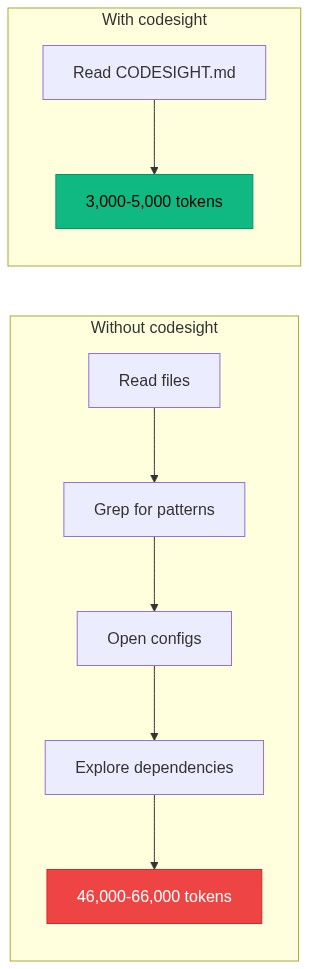
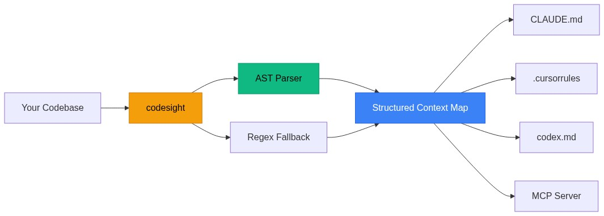
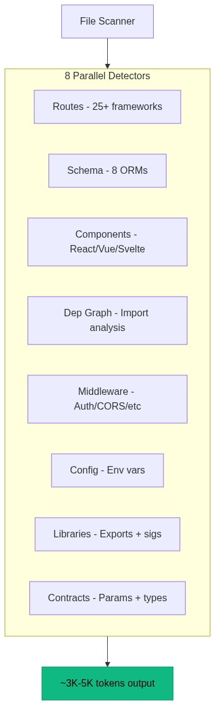
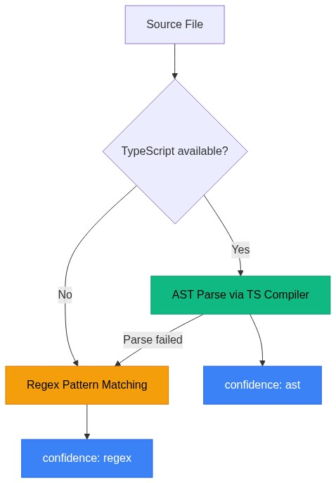
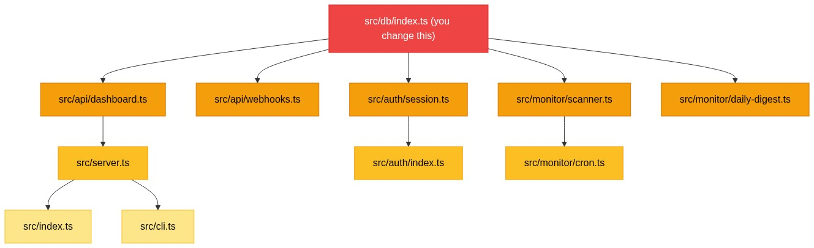
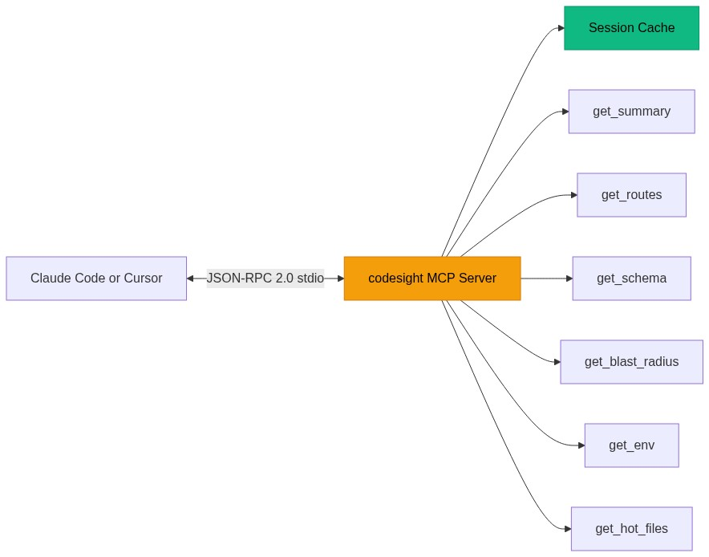

<div align="center">

### Your AI assistant wastes thousands of tokens every conversation just figuring out your project. codesight fixes that in one command.

**Zero dependencies. AST precision. 25+ framework detectors. 8 ORM parsers. 11 MCP tools. One `npx` call.**

**Works with TypeScript, JavaScript, Python, Go, Ruby, Elixir, Java, Kotlin, Rust, and PHP.** TypeScript projects get full AST precision. Everything else uses battle-tested regex detection across the same 25+ frameworks.

[](https://www.npmjs.com/package/codesight)
[](https://www.npmjs.com/package/codesight)
[](https://www.npmjs.com/package/codesight)
[](https://github.com/Houseofmvps/codesight/stargazers)
[](LICENSE)

---

[](https://x.com/kaileskkhumar)
[](https://www.linkedin.com/in/kailesk-khumar)
[](https://houseofmvps.com)

**Built by [Kailesk Khumar](https://www.linkedin.com/in/kailesk-khumar), solo founder of [houseofmvps.com](https://houseofmvps.com)**

*Also: [ultraship](https://github.com/Houseofmvps/ultraship) (39 expert skills for Claude Code) · [claude-rank](https://github.com/Houseofmvps/claude-rank) (SEO/GEO/AEO plugin for Claude Code)*

</div>

---

```
0 dependencies · Node.js >= 18 · 27 tests · 11 MCP tools · MIT
```

## Works With

**Claude Code, Cursor, GitHub Copilot, OpenAI Codex, Windsurf, Cline, Aider**, and anything that reads markdown.

## Install

```bash
npx codesight
```

That's it. Run it in any project root. No config, no setup, no API keys.

```bash
npx codesight --wiki                # Generate wiki knowledge base (.codesight/wiki/)
npx codesight --init                # Generate CLAUDE.md, .cursorrules, codex.md, AGENTS.md
npx codesight --open                # Open interactive HTML report in browser
npx codesight --mcp                 # Start as MCP server (11 tools) for Claude Code / Cursor
npx codesight --blast src/lib/db.ts # Show blast radius for a file
npx codesight --profile claude-code # Generate optimized config for a specific AI tool
npx codesight --benchmark           # Show detailed token savings breakdown
```

## Wiki Knowledge Base (v1.6.0)

Inspired by [Karpathy's LLM wiki pattern](https://gist.github.com/karpathy/442a6bf555914893e9891c11519de94f) — but compiled from AST, not an LLM. Zero API calls. 200ms.

```bash
npx codesight --wiki
```

Generates `.codesight/wiki/` — a persistent knowledge base of your codebase that survives across every session:

```
.codesight/wiki/
  index.md      — catalog of all articles (~200 tokens) — read this at session start
  overview.md   — architecture, subsystems, high-impact files (~500 tokens)
  auth.md       — auth routes, middleware, session flow
  payments.md   — payment routes, webhook handling, billing flow
  database.md   — all models, fields, relations, high-impact DB files
  users.md      — user management routes and related models
  ui.md         — UI components with props
  log.md        — append-only record of every wiki operation
```

**Why this cuts token usage further:**

Instead of loading the full 5K token context map every conversation, your AI reads one targeted article:

| Question | Without wiki | With wiki |
|---|---|---|
| "How does auth work?" | ~12K tokens (reads 8+ files) | ~300 tokens (`auth.md`) |
| "What models exist?" | ~5K tokens (CODESIGHT.md) | ~400 tokens (`database.md`) |
| New session start | ~5K tokens (full reload) | ~200 tokens (`index.md`) |

**Persistent across sessions.** The wiki lives in `.codesight/wiki/`, committed to git. Every new Claude Code, Cursor, or Codex session starts with full codebase knowledge from the first message.

**Auto-regenerates.** Use `--watch` to keep the wiki current as you code. Use `--hook` to regenerate on every commit.

**3 new MCP tools** for wiki access:

| Tool | What it does |
|---|---|
| `codesight_get_wiki_index` | Get the wiki catalog (~200 tokens) at session start |
| `codesight_get_wiki_article` | Read one article by name: `auth`, `database`, `payments`, etc. |
| `codesight_lint_wiki` | Health check: orphan articles, missing cross-links, stale content |

The key difference from general-purpose wiki tools: codesight already knows your routes, schema, blast radius, and middleware from AST — no LLM needed to extract code structure. The wiki is a narrative layer on top of data your codebase already contains.

## Benchmarks (Real Projects)

Every number below comes from running `codesight v1.6.0` on real production codebases. Numbers are verified against actual source — route counts cross-checked against source files, models verified against ORM schema definitions.

| Project | Stack | Files | Routes | Models | Components | Output Tokens | Exploration Tokens | Savings | Scan Time |
|---|---|---|---|---|---|---|---|---|---|
| **SaaS A** | raw-http + Drizzle | 53 | 38 | 12 | 0 | 3,945 | 46,020 | **11.7x** | 184ms |
| **SaaS B** | Hono + Drizzle, 3 workspaces | 40 | 13 | 8 | 10 | 2,865 | 26,130 | **9.1x** | 203ms |
| **SaaS C** | FastAPI (Python) | 138 | 56 | 0 | 0 | 3,129 | 47,450 | **15.2x** | 893ms |

**Average: 12.0x token reduction.** Your AI reads ~3K-5K tokens instead of burning ~26K-47K exploring files.

SaaS C has 0 models because it uses Pydantic validators (request/response schemas), not a SQL ORM. This is correct detection, not a false negative.



### Wiki Token Savings (v1.6.0)

With `--wiki`, targeted questions cost far fewer tokens than loading the full context map:

| Project | Full CODESIGHT.md | Wiki Index (session start) | Targeted article | Wiki articles |
|---|---|---|---|---|
| **SaaS A** | 3,945 tokens | ~200 tokens | ~350 tokens | 9 articles |
| **SaaS B** | 2,865 tokens | ~200 tokens | ~240 tokens | 11 articles |
| **SaaS C** | 3,129 tokens | ~200 tokens | ~160 tokens | 17 articles |

"How does auth work?" goes from loading 3,945 tokens to reading `auth.md` (~350 tokens) — a **11x improvement on targeted queries**.

### Detection Accuracy

Verified against actual source files. Route counts cross-checked against route definitions; schema models cross-checked against ORM table declarations.

| Project | Route Recall | Schema Recall | False Positives | Detection Method |
|---|---|---|---|---|
| **SaaS A** | 38/38 (100%) | 12/12 (100%) | 0 | Schema: AST (Drizzle), Routes: regex (raw-http) |
| **SaaS B** | 13/13 (100%) | 8/8 (100%) | 0 | Full AST (Hono + Drizzle + React) |
| **SaaS C** | 56/57 (98.2%) | 0/0 (correct) | 0 | AST (FastAPI) |

SaaS A uses raw `http.createServer` — codesight correctly falls back to URL pattern matching for routes while still using the TypeScript compiler API for Drizzle schema. SaaS C missed 1 of 57 FastAPI routes (98.2% recall). Zero false positives across all three projects.

### Blast Radius Accuracy

Tested on a production SaaS: changing the database module correctly identified:

- **5 affected files** across API, auth, and server layers
- **All routes** that touch the database
- **12 affected models** (complete schema)
- **BFS depth:** 3 hops through the import graph

### What Gets Detected

Measured across the three benchmark projects:

| Detector | SaaS A (92 files) | SaaS B (53 files) | SaaS C (40 files) |
|---|---|---|---|
| **Routes** | 60 | 38 | 13 |
| **Schema models** | 18 | 12 | 8 |
| **Components** | 16 | 0 | 10 |
| **Library exports** | 36 | 32 | 11 |
| **Env vars** | 22 | 26 | 12 |
| **Middleware** | 5 | 3 | 2 |
| **Import links** | 295 | 101 | 76 |
| **Hot files** | 20 | 20 | 20 |

---

## How It Works





codesight runs all 8 detectors in parallel, then writes the results as structured markdown. The output is designed to be read by an AI in a single file load.

## What It Generates

```
.codesight/
  CODESIGHT.md     Combined context map (one file, full project understanding)
  routes.md        Every API route with method, path, params, and what it touches
  schema.md        Every database model with fields, types, keys, and relations
  components.md    Every UI component with its props
  libs.md          Every library export with function signatures
  config.md        Every env var (required vs default), config files, key deps
  middleware.md    Auth, rate limiting, CORS, validation, logging, error handlers
  graph.md         Which files import what and which break the most things if changed
  report.html      Interactive visual dashboard (with --html or --open)
```

## AST Precision

When TypeScript is installed in the project being scanned, codesight uses the actual TypeScript compiler API to parse your code structurally. No regex guessing.



| What AST enables | Regex alone |
|---|---|
| Follows `router.use('/prefix', subRouter)` chains | Misses nested routers |
| Combines `@Controller('users')` + `@Get(':id')` into `/users/:id` | May miss prefix |
| Parses `router({ users: userRouter })` tRPC nesting | Line-by-line matching |
| Extracts exact Drizzle field types from `.primaryKey().notNull()` chains | Pattern matching |
| Gets React props from TypeScript interfaces and destructuring | Regex on `{ prop }` |
| Detects middleware in route chains: `app.get('/path', auth, handler)` | Not captured |
| Filters out non-route calls like `c.get('userId')` | May false-positive |

AST detection is reported in the output:

```
Analyzing... done (AST: 60 routes, 18 models, 16 components)
```

No configuration needed. If TypeScript is in your `node_modules`, AST kicks in automatically. Works with npm, yarn, and pnpm (including strict mode). Falls back to regex for non-TypeScript projects or frameworks without AST support.

**AST-supported frameworks:** Express, Hono, Fastify, Koa, Elysia (route chains + middleware), NestJS (decorator combining + guards), tRPC (router nesting + procedure types), Drizzle (field chains + relations), TypeORM (entity decorators), React (props from interfaces + destructuring + forwardRef/memo).

## Routes

Not just paths. Methods, URL parameters, what each route touches (auth, database, cache, payments, AI, email, queues), and where the handler lives. Detects routes across 25+ frameworks automatically.

Example output:

```markdown
- `GET` `/api/users/me` [auth, db, cache]
- `PUT` `/api/users/me` [auth, db]
- `POST` `/api/projects` [auth, db, payment]
- `GET` `/api/projects/:id` params(id) [auth, db]
- `POST` `/webhooks/stripe` [db, payment]
- `GET` `/health`
```

## Schema

Models, fields, types, primary keys, foreign keys, unique constraints, relations. Parsed directly from your ORM definitions via AST. No need to open migration files.

Example output:

```markdown
### user
- id: text (pk)
- name: text (required)
- email: text (unique, required)
- role: text (default, required)
- stripeCustomerId: text (fk)

### project
- id: uuid (default, pk)
- ownerId: text (fk, required)
- name: text (required)
- settings: jsonb (required)
- _relations_: ownerId -> user.id
```

## Dependency Graph

The files imported the most are the ones that break the most things when changed. codesight finds them and tells your AI to be careful.

Example output:

```markdown
## Most Imported Files (change these carefully)
- `src/types/index.ts` — imported by **20** files
- `src/db/index.ts` — imported by **12** files
- `src/lib/auth.ts` — imported by **8** files
- `src/lib/cache.ts` — imported by **6** files
- `src/lib/env.ts` — imported by **5** files
```

## Blast Radius



BFS through the import graph finds all transitively affected files, routes, models, and middleware.

```bash
npx codesight --blast src/db/index.ts
```

Example output:

```
  Blast Radius: src/db/index.ts
  Depth: 3 hops

  Affected files (10):
    src/api/users.ts
    src/api/projects.ts
    src/api/webhooks.ts
    src/auth/session.ts
    src/jobs/notifications.ts
    src/server.ts
    src/auth/index.ts
    src/jobs/cron.ts
    src/cli.ts
    src/index.ts

  Affected routes (33):
    GET /api/users/me — src/api/users.ts
    POST /api/projects — src/api/projects.ts
    POST /webhooks/stripe — src/api/webhooks.ts
    ...

  Affected models: user, session, account, project,
    subscription, notification, audit_log
```

Your AI can also query blast radius through the MCP server before making changes.

## Environment Audit

Every env var across your codebase, flagged as required or has default, with the exact file where it is referenced.

Example output:

```markdown
- `DATABASE_URL` **required** — .env.example
- `REDIS_URL` (has default) — .env.example
- `STRIPE_SECRET_KEY` **required** — src/lib/payments.ts
- `STRIPE_WEBHOOK_SECRET` **required** — .env.example
- `RESEND_API_KEY` **required** — .env.example
- `JWT_SECRET` **required** — src/lib/auth.ts
```

## Token Benchmark

See exactly where your token savings come from:

```bash
npx codesight --benchmark
```

Example output (92-file monorepo):

```
  Token Savings Breakdown:
  ┌──────────────────────────────────────────────────┐
  │ What codesight found         │ Exploration cost   │
  ├──────────────────────────────┼────────────────────┤
  │  60 routes                   │ ~24,000 tokens     │
  │  18 schema models            │ ~ 5,400 tokens     │
  │  16 components               │ ~ 4,000 tokens     │
  │  36 library files            │ ~ 7,200 tokens     │
  │  22 env vars                 │ ~ 2,200 tokens     │
  │   5 middleware               │ ~ 1,000 tokens     │
  │  20 hot files                │ ~ 3,000 tokens     │
  │  92 files (search overhead)  │ ~ 4,000 tokens     │
  ├──────────────────────────────┼────────────────────┤
  │ codesight output             │ ~ 5,129 tokens     │
  │ Manual exploration (1.3x)    │ ~66,040 tokens     │
  │ SAVED PER CONVERSATION       │ ~60,911 tokens     │
  └──────────────────────────────┴────────────────────┘
```

### How Token Savings Are Calculated

Each detector type maps to a measured token cost that an AI would spend to discover the same information manually:

| What codesight finds | Tokens saved per item | Why |
|---|---|---|
| Each route | ~400 tokens | AI reads the handler file, greps for the path, reads middleware |
| Each schema model | ~300 tokens | AI opens migration/ORM files, parses fields manually |
| Each component | ~250 tokens | AI opens component files, reads prop types |
| Each library export | ~200 tokens | AI greps for exports, reads signatures |
| Each env var | ~100 tokens | AI greps for `process.env`, reads .env files |
| Each file scanned | ~80 tokens | AI runs glob/grep operations to find relevant files |

The 1.3x multiplier accounts for AI revisiting files during multi-turn conversations. These estimates are conservative. A developer manually verified that Claude Code spends 40-70K tokens exploring the same projects that codesight summarizes in 3-5K tokens.

## Supported Stacks

| Category | Supported |
|---|---|
| **Routes** | Hono, Express, Fastify, Next.js (App + Pages), Koa, NestJS, tRPC, Elysia, AdonisJS, SvelteKit, Remix, Nuxt, FastAPI, Flask, Django, Go (net/http, Gin, Fiber, Echo, Chi), Rails, Phoenix, Spring Boot, Actix, Axum, raw http.createServer |
| **Schema** | Drizzle, Prisma, TypeORM, Mongoose, Sequelize, SQLAlchemy, ActiveRecord, Ecto (8 ORMs) |
| **Components** | React, Vue, Svelte (auto-filters shadcn/ui and Radix primitives) |
| **Libraries** | TypeScript, JavaScript, Python, Go, Ruby, Elixir, Java, Kotlin, Rust (exports with function signatures) |
| **Middleware** | Auth, rate limiting, CORS, validation, logging, error handlers |
| **Dependencies** | Import graph with hot file detection (most imported = highest blast radius) |
| **Contracts** | URL params, request types, response types from route handlers |
| **Monorepos** | pnpm, npm, yarn workspaces (cross-workspace detection) |
| **Languages** | TypeScript, JavaScript, Python, Go, Ruby, Elixir, Java, Kotlin, Rust, PHP |

## AI Config Generation

```bash
npx codesight --init
```

Generates ready-to-use instruction files for every major AI coding tool at once:

| File | Tool |
|---|---|
| `CLAUDE.md` | Claude Code |
| `.cursorrules` | Cursor |
| `.github/copilot-instructions.md` | GitHub Copilot |
| `codex.md` | OpenAI Codex CLI |
| `AGENTS.md` | OpenAI Codex agents |

Each file is pre-filled with your project's stack, architecture, high-impact files, and required env vars. Your AI reads it on startup and starts with full context from the first message.

## MCP Server (8 Tools)

```bash
npx codesight --mcp
```

Runs as a Model Context Protocol server. Claude Code and Cursor call it directly to get project context on demand.

```json
{
  "mcpServers": {
    "codesight": {
      "command": "npx",
      "args": ["codesight", "--mcp"]
    }
  }
}
```



| Tool | What it does |
|---|---|
| `codesight_get_wiki_index` | Wiki catalog (~200 tokens) — read at session start |
| `codesight_get_wiki_article` | Read one wiki article by name: `auth`, `database`, `payments`, etc. |
| `codesight_lint_wiki` | Health check: orphan articles, missing cross-links |
| `codesight_scan` | Full project scan (~3K-5K tokens) |
| `codesight_get_summary` | Compact overview (~500 tokens) |
| `codesight_get_routes` | Routes filtered by prefix, tag, or method |
| `codesight_get_schema` | Schema filtered by model name |
| `codesight_get_blast_radius` | Impact analysis before changing a file |
| `codesight_get_env` | Environment variables (filter: required only) |
| `codesight_get_hot_files` | Most imported files with configurable limit |
| `codesight_refresh` | Force re-scan (results are cached per session) |

Your AI asks for exactly what it needs instead of loading the entire context map. Session caching means the first call scans, subsequent calls return instantly.

## AI Tool Profiles

```bash
npx codesight --profile claude-code
npx codesight --profile cursor
npx codesight --profile codex
npx codesight --profile copilot
npx codesight --profile windsurf
```

Generates an optimized config file for a specific AI tool. Each profile includes your project summary, stack info, high-impact files, required env vars, and tool-specific instructions on how to use codesight outputs. For Claude Code, this includes MCP tool usage instructions. For Cursor, it points to the right codesight files. Each profile writes to the correct file for that tool.

## Visual Report

```bash
npx codesight --open
```

Opens an interactive HTML dashboard in your browser. Routes table with method badges and tags. Schema cards with fields and relations. Dependency hot files with impact bars. Env var audit. Token savings breakdown. Useful for onboarding or just seeing your project from above.

## GitHub Action

Add to your CI pipeline to keep context fresh on every push:

```yaml
name: codesight
on: [push]
jobs:
  scan:
    runs-on: ubuntu-latest
    steps:
      - uses: actions/checkout@v4
      - uses: actions/setup-node@v4
        with:
          node-version: 20
      - run: npm install -g codesight && codesight
      - uses: actions/upload-artifact@v4
        with:
          name: codesight
          path: .codesight/
```

## Watch Mode and Git Hook

**Watch mode** re-scans automatically when your code changes:

```bash
npx codesight --watch
```

Only triggers on source and config files (`.ts`, `.js`, `.py`, `.go`, `.prisma`, `.env`, etc.). Ignores `node_modules`, build output, and non-code files. Shows which files changed before each re-scan. Your config (disabled detectors, plugins) is preserved across re-scans.

**Git hook** regenerates context on every commit:

```bash
npx codesight --hook
```

Context stays fresh without thinking about it.

## All Options

```bash
npx codesight                              # Scan current directory
npx codesight ./my-project                 # Scan specific directory
npx codesight --wiki                       # Generate wiki knowledge base
npx codesight --init                       # Generate AI config files
npx codesight --open                       # Open visual HTML report
npx codesight --html                       # Generate HTML report without opening
npx codesight --mcp                        # Start MCP server (11 tools)
npx codesight --blast src/lib/db.ts        # Show blast radius for a file
npx codesight --profile claude-code        # Optimized config for specific tool
npx codesight --watch                      # Watch mode (add --wiki to auto-regenerate wiki)
npx codesight --wiki --watch               # Watch + auto-regenerate wiki on changes
npx codesight --hook                       # Install git pre-commit hook (includes wiki)
npx codesight --benchmark                  # Detailed token savings breakdown
npx codesight --json                       # Output as JSON
npx codesight -o .ai-context              # Custom output directory
npx codesight -d 5                         # Limit directory depth
```

## How It Compares

| | codesight | File concatenation tools | AST-based tools (e.g. code-review-graph) |
|---|---|---|---|
| **Parsing** | AST (TypeScript compiler) + regex fallback | None | Tree-sitter + SQLite |
| **Token reduction** | 9x-13x measured on real projects | 1x (dumps everything) | 8x reported |
| **Route detection** | 25+ frameworks, auto-detected | None | Limited |
| **Schema parsing** | 8 ORMs with field types and relations | None | Varies |
| **Blast radius** | BFS through import graph | None | Yes |
| **AI tool profiles** | 5 tools (Claude, Cursor, Codex, Copilot, Windsurf) | None | Auto-detect |
| **MCP tools** | 8 specialized tools with session caching | None | 22 tools |
| **Setup** | `npx codesight` (zero deps, zero config) | Copy/paste | `pip install` + optional deps |
| **Dependencies** | Zero (borrows TS from your project) | Varies | Tree-sitter, SQLite, NetworkX, etc. |
| **Language** | TypeScript (zero runtime deps) | Varies | Python |
| **Scan time** | 185-290ms on real projects | Varies | Under 2s reported |

codesight is purpose-built for the problem most developers actually have: giving their AI assistant enough context to be useful without wasting tokens on file exploration. It focuses on structured extraction (routes, schema, components, dependencies) rather than general-purpose code graph analysis.

## Contributing

```bash
git clone https://github.com/Houseofmvps/codesight.git
cd codesight
pnpm install
pnpm dev              # Run locally
pnpm build            # Compile TypeScript
pnpm test             # Run 27 tests
```

PRs welcome. Open an issue first for large changes.

## License

MIT

---

<div align="center">

If codesight saves you tokens, [star it on GitHub](https://github.com/Houseofmvps/codesight) so others find it too.

[](https://github.com/Houseofmvps/codesight/stargazers)

</div>
